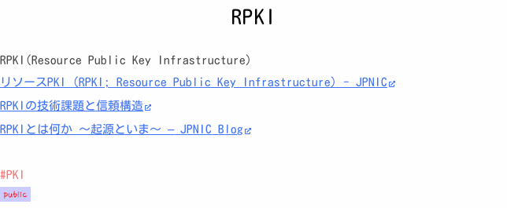
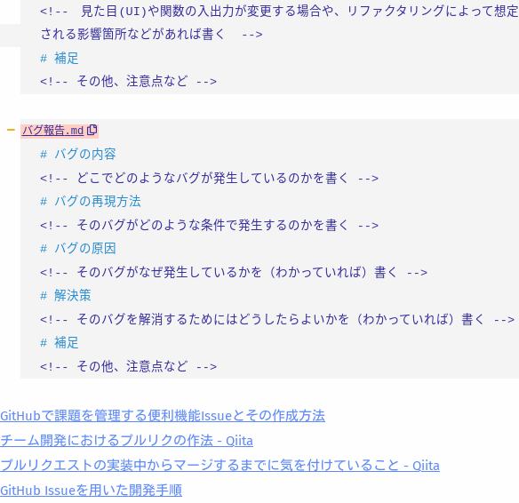

# scrapbox-random-clip

Scrapbox のプロジェクトからランダムにページをスクリーンショット

## パッケージインストール

`npm install`

## 使い方

```
Usage: npx ts-node app.ts [options]

Options:
  -p, --project <projectname>  scrapbox projectname
  -c, --connectsid <value>     connect.sid value (used for private projects)
  -s --size <imagesize>        screenshot image size(px) (default: 560)
  -h, --help                   display help for command
```

- `-p, --project`オプション
  - Scrapbox のプロジェクトの Settings を開くと表示される Project url を指定
  - プロジェクトを Web で開いたときの`http://scrapbox.io/<Project url>/`の`<Project url>`と同じ
- `-c, --connectsid`オプション
  - プライベートプロジェクトのときに指定
  - Scrapbox の Cookie の connect.sid に対応する値を指定
- `-s, --size`オプション
  - スクリーンショットのサイズを指定(デフォルトは 560px)
  - ページ全体のサイズが指定したサイズより小さい場合、ページ全体のサイズを取得
  - アルゴリズムの都合上、指定したサイズより大きくなる場合あり
- 標準出力先に出力される文字列
  - 1 行目にページ名、2 行目にページの URL、3 行目に生成したスクリーンショットのファイル名

## 使用例

### public プロジェクト lsadsfj をランダムにスクリーンショット

コマンド

```
scrapbox-random-clip$ npx ts-node app.ts -p lsadsfj
RPKI
https://scrapbox.io/lsadsfj/RPKI
20241012233926.png
```

スクリーンショット結果



### private プロジェクト judzlf-note をランダムにスクリーンショット

コマンド

```
scrapbox-random-clip$ npx ts-node app.ts -p judzlf-note -c "${connectsid}"
github運用
https://scrapbox.io/judzlf-note/github%E9%81%8B%E7%94%A8
20220901162335.png
```

※`${connectsid}`はシェル変数

スクリーンショット結果


